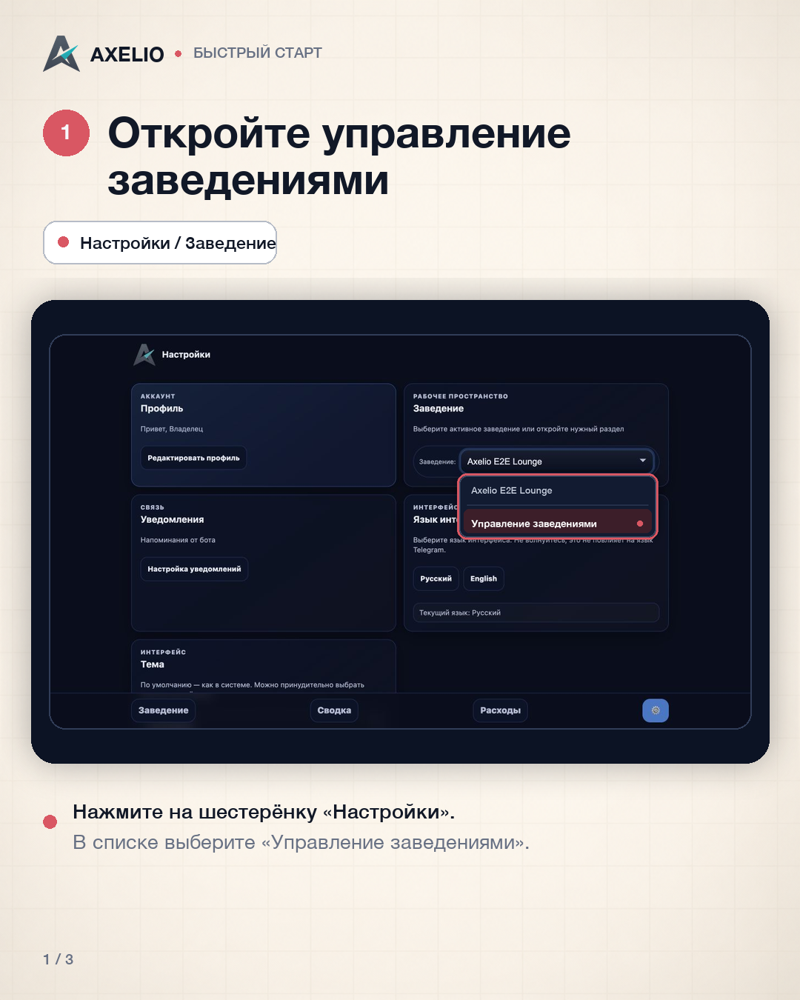
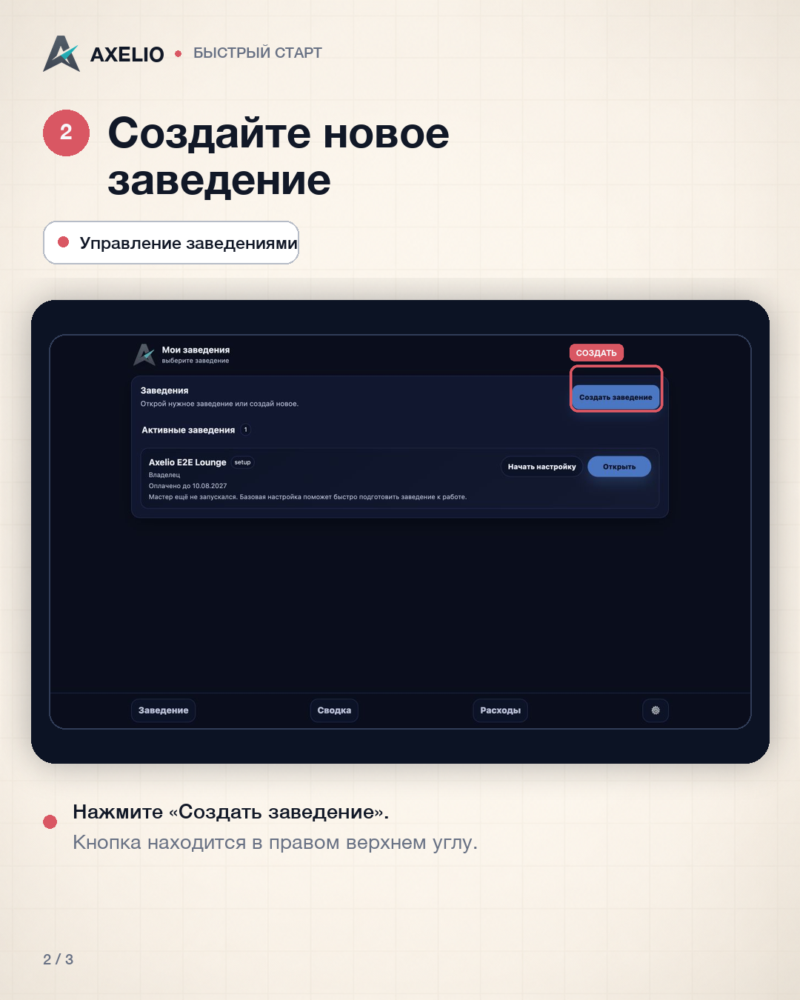
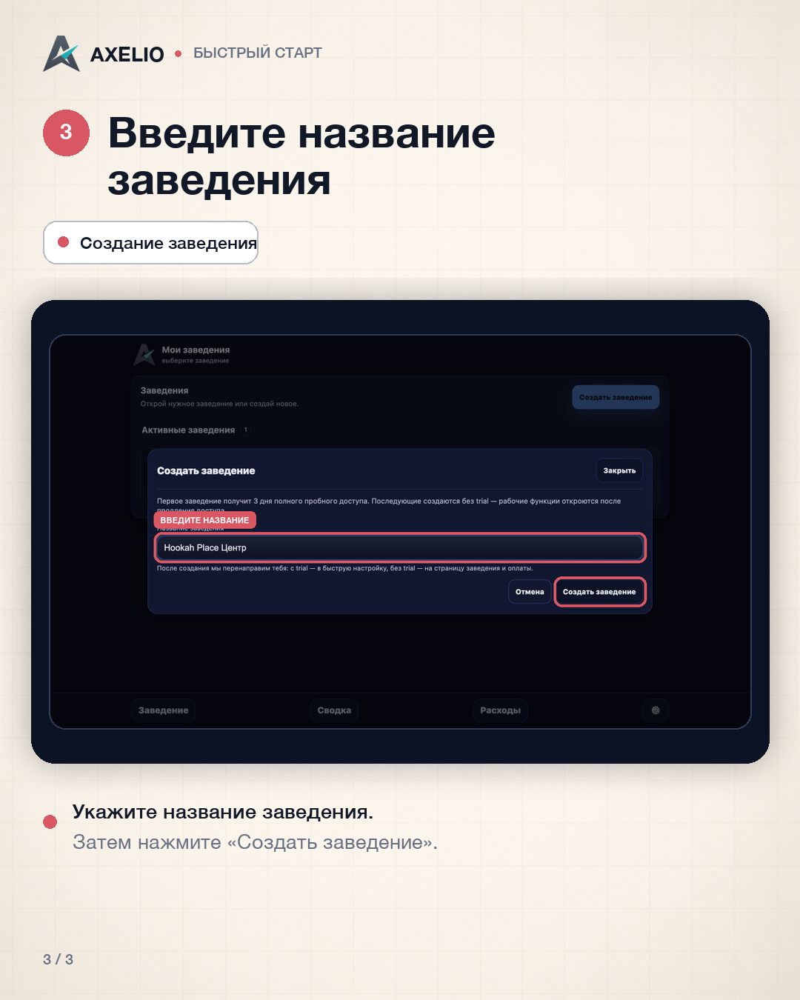

# Axelio: как это работает

## Как создать заведение

В Axelio всё начинается с карточки заведения. Внутри неё будут храниться команда, смены, выручка, расходы и правила расчёта зарплаты.

### 1. Откройте управление заведениями

В нижнем меню откройте **«Настройки»** — это кнопка с шестерёнкой. В блоке **«Заведение»** нажмите на список активных заведений и выберите **«Управление заведениями»**.

### 2. Нажмите «Создать заведение»

На странице **«Мои заведения»** нажмите кнопку **«Создать заведение»** в правой части экрана.

### 3. Укажите название

Введите название, по которому вы и сотрудники будете узнавать заведение внутри Axelio. Юридическое наименование здесь не требуется — можно использовать привычное рабочее название.

Нажмите **«Создать заведение»**. Первое заведение получает 3 дня полного пробного доступа. Для последующих заведений рабочие функции открываются после продления доступа.

### Готово

Карточка заведения создана. Для первого заведения Axelio сразу откроет мастер со **способов оплаты** — повторно подтверждать название больше не нужно.

Теперь можно переходить к первой рабочей настройке. О способах оплаты расскажем в следующем выпуске.

**Частый вопрос:** можно ли изменить название позже? Да. Оно не фиксируется навсегда, и его можно поменять в карточке заведения.
